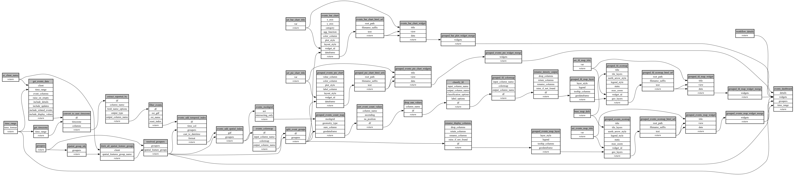

```
# AUTOGENERATED BY ECOSCOPE-WORKFLOWS; see fingerprint in README.md for details

```

```yaml
# fingerprint:
artifacts_sha256_basic: 1d415bc690186fad73d852bf6bf59746fe1b21d66cd7b50c662c961cf2e2ac85
artifacts_sha256_strict: d9d28ec3fa685485ef292c27a2934b8f943d1fe9ec0a83b53456cf9c2449a1c3
installed_requirements:
- channel: https://repo.prefix.dev/ecoscope-workflows/
  name: ecoscope-workflows-core
  version: {version: ==0.0.70}
- channel: https://repo.prefix.dev/ecoscope-workflows/
  name: ecoscope-workflows-ext-ecoscope
  version: {version: ==0.0.70}
params_sha256: 8d762db20646375e25a9e78bc0d73f4db41faa86469896244117c03e68bb25d2
spec_sha256: 7bfc933be80b35c7ed7f4aac83d0ed4b658d3e57b5666bc11ed84cda73a01622

```

# ecoscope-workflows-events-workflow


