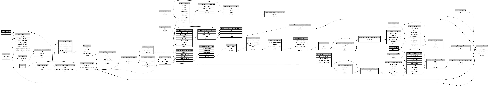

```
# AUTOGENERATED BY ECOSCOPE-WORKFLOWS; see fingerprint in README.md for details

```

```yaml
# fingerprint:
artifacts_sha256_basic: 838e2d252d1c08787727faf33d8f26f2fd180dfe67750f2c2c6ea24eebce240a
artifacts_sha256_strict: c3bbca7b64190a61f48f20e2911c085411945233c542878c7fc53e034e54ae64
installed_requirements:
- channel: https://repo.prefix.dev/ecoscope-workflows/
  name: ecoscope-platform
  version: {version: ==2.11.1}
params_sha256: 57f9fc795ee88a94f36f41f8aed46659eb8a9fc3930f27eee396131b3e3ac49e
spec_sha256: c6d4e26c3763450f350025aa0ce449ef614ec25efcc11dc11f6aa51cb9339443

```

# ecoscope-workflows-events-workflow


