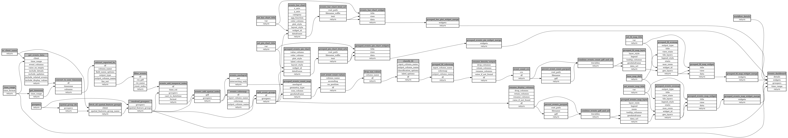

```
# AUTOGENERATED BY ECOSCOPE-WORKFLOWS; see fingerprint in README.md for details

```

```yaml
# fingerprint:
artifacts_sha256_basic: 1333071c0f46445900686770c15bfdc5bbc4f42aaa739936be507253f1f6e2af
artifacts_sha256_strict: 31616e2acc3440b5f86ebf93671a7a4638e7ef70594cd19ca04d88ec8741f75d
installed_requirements:
- channel: https://repo.prefix.dev/ecoscope-workflows/
  name: ecoscope-platform
  version: {version: ==2.15.0}
- channel: conda-forge
  name: pydeck
  version: {version: ==0.9.2}
params_sha256: b407b48dd9324fdaad7d5886069639ff1e061c62b1d9e196ffc52e2d2840587c
spec_sha256: 9fa71611d745f1f66932069f4597c7ec7c0e7b43785721d058c3c4d68170f924

```

# ecoscope-workflows-events-workflow


