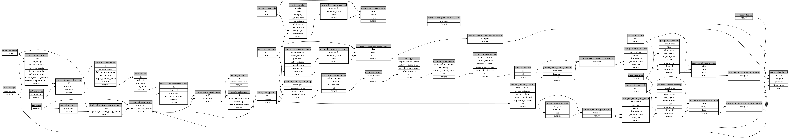

```
# AUTOGENERATED BY ECOSCOPE-WORKFLOWS; see fingerprint in README.md for details

```

```yaml
# fingerprint:
artifacts_sha256_basic: 70f66eb39145741cc47a36f1679ed7e399bf88c281dd8103b3b77de6b3ce25a8
artifacts_sha256_strict: 6bff1fe8d008664effd54de282e91dcc3c7dd359eba359f10edc0e2f8964bd01
installed_requirements:
- channel: https://repo.prefix.dev/ecoscope-workflows/
  name: ecoscope-platform
  version: {version: ==2.23.0}
- channel: conda-forge
  name: pydeck
  version: {version: ==0.9.2}
params_sha256: 00cf1df7b1d3e8ea2551fedd5c14e706217f2ee23afaae5ae7d7eca04b239b6a
spec_sha256: 1dd5e697b2c19b970a2abe8d0d5d2297bdbbd54c8e07101fc79284b014e1e6ec

```

# ecoscope-workflows-events-workflow


