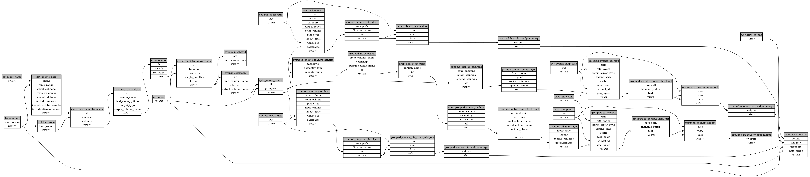

```
# AUTOGENERATED BY ECOSCOPE-WORKFLOWS; see fingerprint in README.md for details

```

```yaml
# fingerprint:
artifacts_sha256_basic: b6d322951c916a93a91145ade2d737a3f389826ff87b4ede5353d03aaf8c2755
artifacts_sha256_strict: c8792106be29d9942d22fd08d81961022704279366e3c4dcad24a4079897664a
installed_requirements:
- channel: https://repo.prefix.dev/ecoscope-workflows/
  name: ecoscope-workflows-core
  version: {version: ==0.21.2}
- channel: https://repo.prefix.dev/ecoscope-workflows/
  name: ecoscope-workflows-ext-ecoscope
  version: {version: ==0.21.2}
params_sha256: c60558c3f273454d93bfcef5c1b463e7fdcaff3a79db043a4b0da782d1509b60
spec_sha256: 16fe13b3ab28c0ed2de12d4ceaab8f350d45b4ec405c9c6534a8d82d4cfb98c2

```

# ecoscope-workflows-events-workflow


